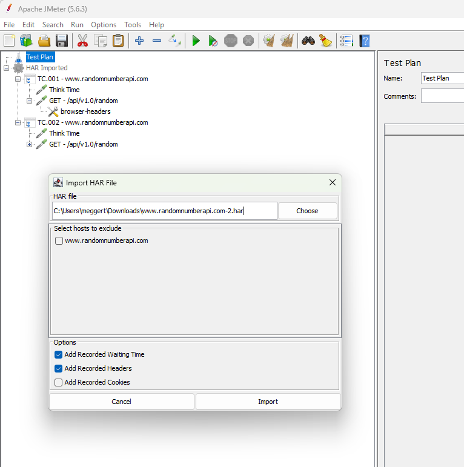

The JMeter HAR Importer plugin allows users to import HTTP Archive (HAR) files into Apache JMeter. The imported HAR
files are then used to create JMeter sampler elements, facilitating the conversion of HAR files into JMeter test plans.

# Motivation

In the realm of web performance and load testing, the choice of tools and methods for capturing web traffic is critical.
While the JMeter Recorder is a powerful tool within the JMeter ecosystem, we advocate for the use of HTTP Archive (HAR)
files for several key reasons. Here, we outline the motivations behind choosing HAR files for capturing and analyzing
web traffic, emphasizing portability and sharing, browser-agnostic capabilities, and ease of use.

## Portability and Sharing

HAR files are a standardized format for recording the intricate details of HTTP requests and responses. This
standardization not only facilitates a deeper level of analysis but also ensures that HAR files can be effortlessly
shared and utilized across diverse tools and platforms. Whether you're collaborating with team members who use different
systems or integrating with various analysis tools, HAR files' compatibility significantly enhances collaborative
efforts and streamlines the testing process.

## Browser-Agnostic Approach

One of the strongest suits of HAR files is their browser-agnostic nature. Given that they can be generated from the
developer tools of most modern web browsers, HAR files capture web traffic in the user's actual environment,
irrespective of the browser. This universality allows testers to replicate and analyze scenarios in a more accurate and
realistic manner, ensuring that performance insights are as close to the end-user experience as possible.

## Ease of Use

Generating HAR files is remarkably straightforward, requiring no complex setup or configuration. Unlike the JMeter
Recorder, which necessitates setting up proxy servers and specific recording settings, HAR files can be produced
directly from the browser’s developer console. This ease of use is particularly beneficial in dynamic testing
environments and when working with applications where modification access is restricted. By simplifying the capture
process, HAR files enable testers to focus more on analysis and less on configuration, facilitating a more efficient
testing workflow. Even your customers are able to generate their testing scenarios themselves without any additional
knowledge about third party tools other than the browser itself.

# Recording and Saving HAR Files in Google Chrome

Google Chrome offers a straightforward process for capturing HTTP Archive (HAR) files, which are invaluable for
analyzing web traffic and diagnosing performance issues. This section provides a step-by-step guide on how to record and
save HAR files directly from Chrome's Developer Tools, enabling you to gather comprehensive information about your web
application's network activity.

## Step 1: Open Developer Tools

1. Navigate to the web page you wish to analyze.
2. Open Chrome's Developer Tools by either:
    - Right-clicking on the page and selecting `Inspect`, or
    - Using the keyboard shortcut `Ctrl+Shift+I` or `F12` (Windows/Linux) or `Cmd+Opt+I` (Mac).

## Step 2: Record Network Activity

1. Go to the `Network` tab within the Developer Tools. Here, you'll see a record button (the red circle at the top-left
   corner of the tab). Ensure it's red to indicate recording is active. If it's grey, click it to start recording.
2. Check the `Preserve log` box to keep the network log across page loads. This is particularly useful for capturing
   traffic on pages that perform automatic redirections or for comprehensive analysis across multiple page interactions.
3. Refresh the webpage to start capturing the network traffic. It's essential to start with a clean state to ensure you
   capture all relevant network activity from the beginning of the page load.

## Step 3: Save the HAR File

1. Once you have recorded the necessary network activity, right-click anywhere within the grid of network requests and
   select `Save all as HAR with content`.
2. Choose your desired location on your computer and save the file.

This HAR file now contains a detailed record of all network requests and responses made during the recording, along with
timing information, headers, cookies, and other important data. This file can be used for further analysis, shared with
team members for collaborative diagnostics, or imported into various tools that support HAR files for more in-depth
performance evaluation.

# Installation

To install the JMeter HAR Importer plugin, follow these steps:

1. In JMeter install the Plugins Manager
2. Choose the "HAR (HTTP Archive) Import" plugin

# Usage

Once installed, follow these steps to import a HAR file into JMeter:

1. Launch JMeter.
2. Go to the "Tools" menu.
3. Click on "Import HAR File".
4. In the dialog box that appears, browse and select the HAR file you want to import.
5. Click "Import".
6. The plugin will automatically create HTTP Sampler requests for each entry in the HAR file, along with necessary
   configurations such as Header Managers and Cookie Managers.

# Contributing

Contributions to the JMeter HAR Importer plugin are welcome! If you encounter any bugs or have feature requests, please
submit an issue on the [GitHub repository](https://github.com/Qytera-Gmbh/JMeterHARImporterPlugin/issues).

# License

This plugin is licensed under the MIT License. See the [LICENSE](LICENSE) file for details.

# Deploy and Test

Execute `run.bat`, maybe the path to your JMeter installation must be adapted to the right location
`-Djmeter.path=C:/scoop/apps/jmeter/current`.
